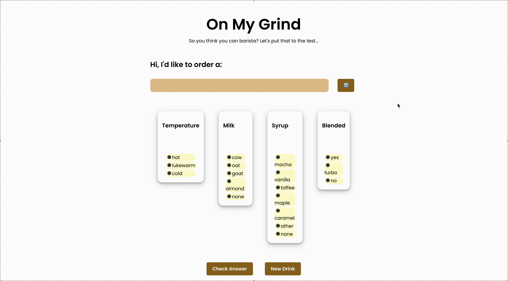

# ☕ On My Grind - Barista App

A React-based quiz application inspired by Wordle where users test their knowledge of Starbucks drink recipes. Players guess the temperature, milk type, syrup flavor, and blendedness of randomly selected drinks and receive instant visual feedback on their accuracy.

## Preview



## Features

### Features
- **Random Drink Selection**: Click the refresh button to get a new drink to guess
- **Interactive Form**: Select from multiple choice radio buttons for each ingredient category
- **Live Feedback**: Selected options appear in answer boxes above each category
- **Answer Validation**: Click "Check Answer" to see visual feedback - red backgrounds for incorrect answers, purple for correct ones
- **Clean Reset**: "New Drink" button clears all inputs and generates a fresh challenge
- **Text Input Mode**: Type answers instead of selecting radio buttons
- **Input Validation**: Alerts users when typed answers don't match available options
- **Enhanced UX**: Custom styling for text inputs with placeholder guidance

## Technologies Used

- **React** - Component-based UI framework
- **Vite** - Fast build tool and development server
- **CSS3** - Flexbox layout and custom styling
- **JSON** - Static data storage for drink recipes

## Project Structure

```
barista-app/
├── src/
│   ├── components/
│   │   ├── BaristaForm.jsx       # Main form component with quiz logic
│   │   └── RecipeChoices.jsx     # Reusable radio button component
│   ├── drinks.json               # Starbucks drink data
│   ├── App.jsx                   # Root application component
│   ├── App.css                   # Application styling
│   └── main.jsx                  # Application entry point
├── public/
│   └── assets/
│       └── demo.gif              # Application demo
└── README.md
```

## How to Play

1. Click the refresh button (🔄) to generate a random Starbucks drink
2. Look at the drink name and guess its ingredients
3. Select your answers for each category:
   - **Temperature**: hot, lukewarm, cold
   - **Milk**: cow, oat, goat, almond, none
   - **Syrup**: mocha, vanilla, toffee, maple, caramel, other, none
   - **Blended**: yes, turbo, no
4. Click "Check Answer" to see how you did
5. Use "New Drink" to try another challenge