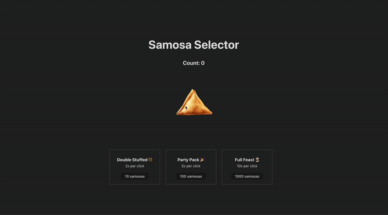

# Samosa Selector
**Samosa Selector** is a small, local clicker game built with React. Click the samosa image to collect samosas, then spend them on upgrades to increase how many samosas you earn per click.

## 🚀 Features
- Click the samosa image to earn samosas (count displayed in the header).
- Three purchasable upgrades that multiply your click power:
  - Double Stuffed (👯‍♀️) — 2x multiplier for 10 samosas
  - Party Pack (🎉) — 5x multiplier for 100 samosas
  - Full Feast (👩🏽‍��) — 10x multiplier for 1000 samosas
- Instant feedback: clicking and purchases update the UI immediately.

## 📸 Preview

## 🛠️ Technologies Used
- **React**: Component-based UI
- **JSX**: App's UI structure and wire event handlers
- **JavaScript**: Module syntax, arrow functions, and functional React component patterns
- **CSS**: App styling and layout